# 🔐 Cisco ASA as DHCP & SSH Server – Packet Tracer Lab

This project demonstrates how to configure a **Cisco ASA Firewall** to act as both a **DHCP server** and an **SSH-enabled secure device** using **Cisco Packet Tracer**. The lab is designed for students and beginners learning about firewall basics, remote access, and network services in Cisco environments.

---

## 📁 Files Included

- `cisco ASA as dhcp & SSH configuration.pkt` – Packet Tracer simulation file for this lab
- `screenshots` – Visual walkthrough of topology and configurations

👉 [Click here to download the .pkt file directly](https://github.com/idabeygunarathna/Cisco-ASA-Firewall-SSH/blob/main/cisco%20ASA%20as%20dhcp%20%26%20SSH%20configuration.pkt)

---

## 🌐 Network Topology Overview

- **Firewall Device**: Cisco ASA 5506-X
- **Internal Network**: `192.168.100.0/24`
- **Connected Devices**: 7 PCs , 3 Layer 2 switches , 5 servers
- **Interfaces**:
  - `Gig1/3` → **Outside** (Security Level 0)
  - `Gig1/1` → **Inside** (Security Level 100)
  - `Gig1/2` → **DMZ** (Security Level 70)

---

## ⚙️ Configuration Highlights

- ✅ ASA hostname, interface IPs, and security levels
- ✅ DHCP configuration for inside clients (IP pool + DNS)
- ✅ SSH enabled with local user authentication
- ✅ RSA key generation for secure SSH access
- ✅ Access control for SSH from inside network only

---

## 🧪 How to Use This Lab

1. Open the `.pkt` file using **Cisco Packet Tracer v7.3 or newer**.
2. Explore the ASA device and inspect CLI configuration.
3. Verify DHCP functionality by checking IP addresses on the PCs.
4. Test SSH access from any inside PC to the ASA using the terminal.
5. Refer to screenshots for visual configuration references.

---

## 📸 Screenshots

### 🖥️ Network Topology
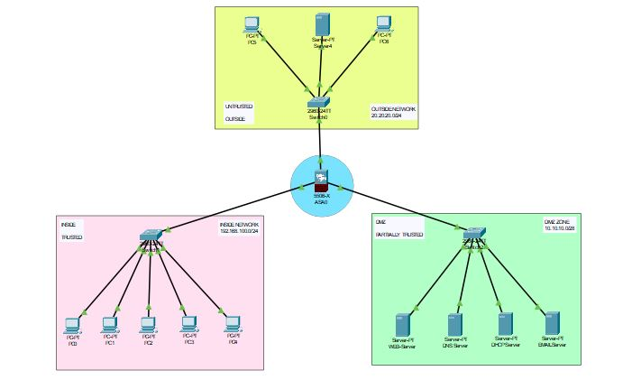
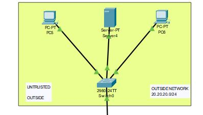
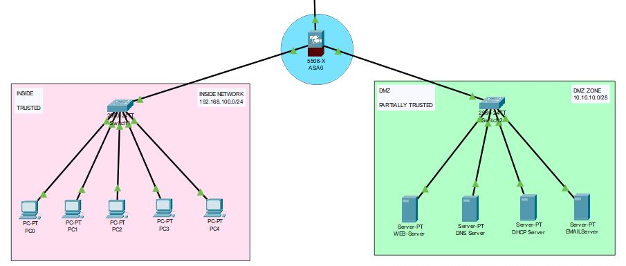

### 🖥️ Basic Configuration on ASA
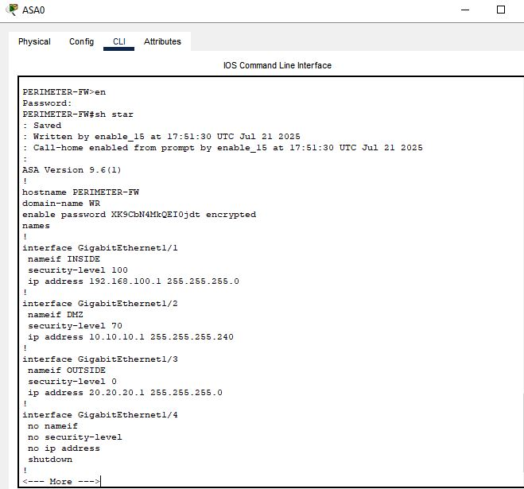
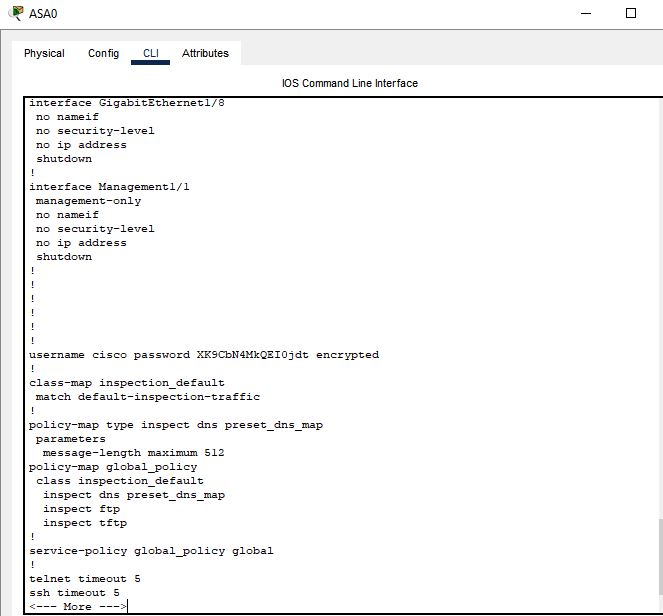

### 📦 DHCP Configuration on ASA
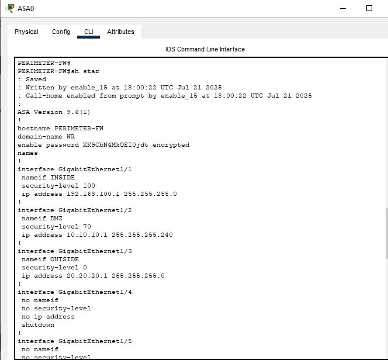
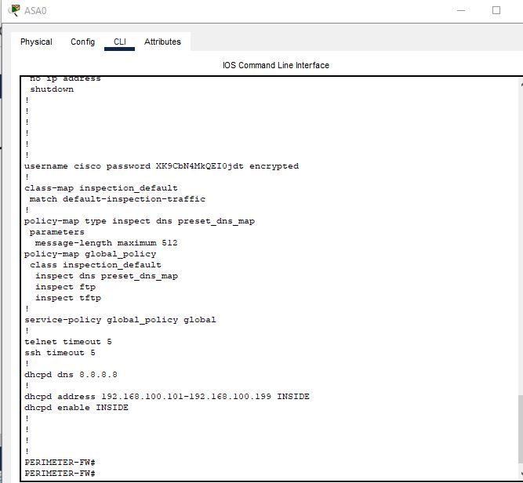

### 🔐 SSH Setup with AAA and RSA
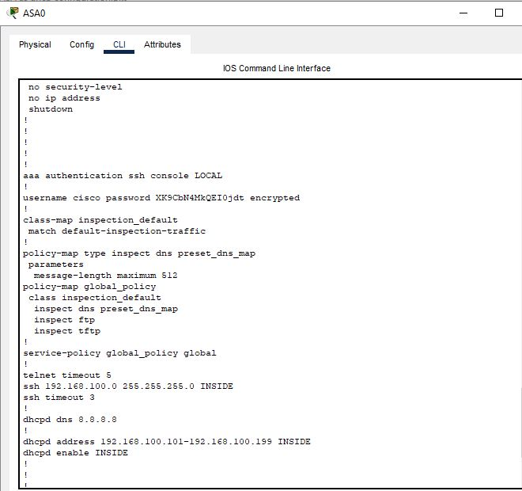

### 💻 PC Receives DHCP IP
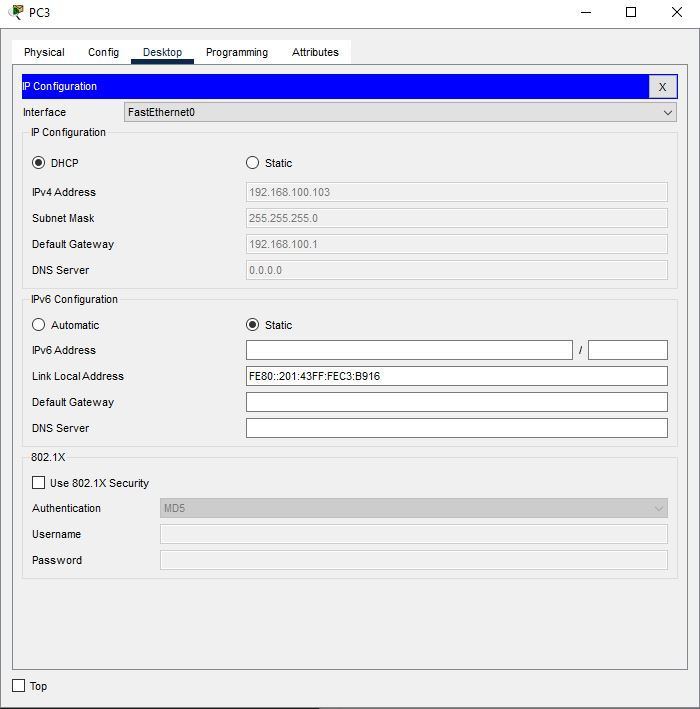

### ✅ SSH Access Success & Ping Test
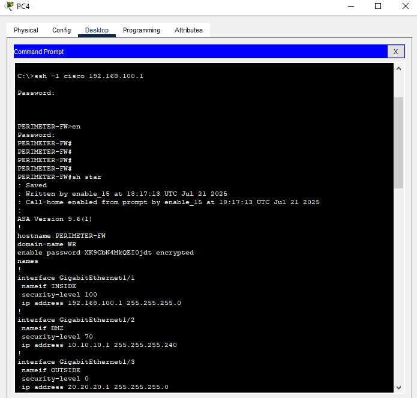
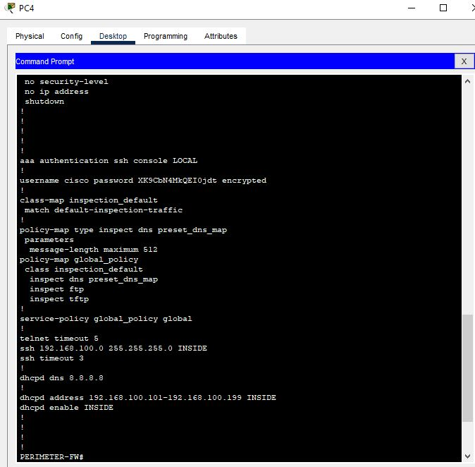

---

## 👤 Author

**Inishi Dinethma**  
Undergraduate | BSc (Hons) in Computer Networks  
NSBM Green University – Sri Lanka

---

## 🔗 Connect With Me

- GitHub: [github.com/inishi](https://github.com/idabeygunarathna)
- LinkedIn: [linkedin.com/in/inishi](https://www.linkedin.com/in/inishi-dinethma-852376264)

---

## 🏷️ Tags

`Cisco ASA` `Packet Tracer` `Firewall` `SSH` `DHCP` `Cisco Lab` `Cybersecurity` `NSBM` `Student Project`

